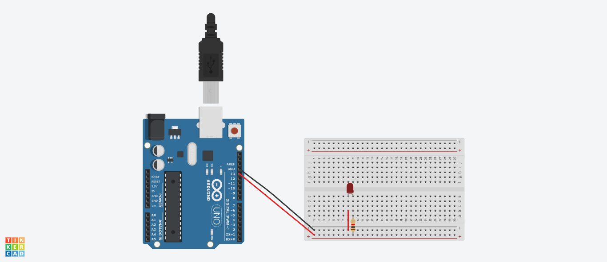

# MANIPULANDO UM LED 
Objetivos: 

- Perceber a equivalência de um diagrama de blocos e um código;
- Familiarizar-se com o ambiente de programação do Arduino; 
- Construir um circuito de LED básico;
- Conhecer LED, Jumper e placa de prototipação; 
- Identificar os polos do LED;
- Conhecer a representação de Ohms em resistores; 
- Aprender a utilizar uma placa de prototipação(ensaio) e os componentes LED, jumper e resistor;
- Aprender a construir um circuito e a importância da posição e ordem dos componentes. 

Enunciado: Neste experimento você irá fazer com que o LED incorporado e um LED pisque utilizando o pino digital 13 (pino digital incorporado LED_BUILTIN = 13). 

Lista de componentes: 
- 1 Arduíno UNO R3; 
- 1 Um cabo de conexão USB; 
- 1 Placa de prototipação (Protoboard);
- 1 LED;
- 1 Resistor de 220 Ω ohms; 
- 3 Jumpers (macho-macho).

